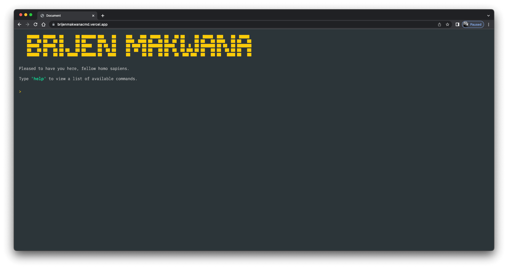
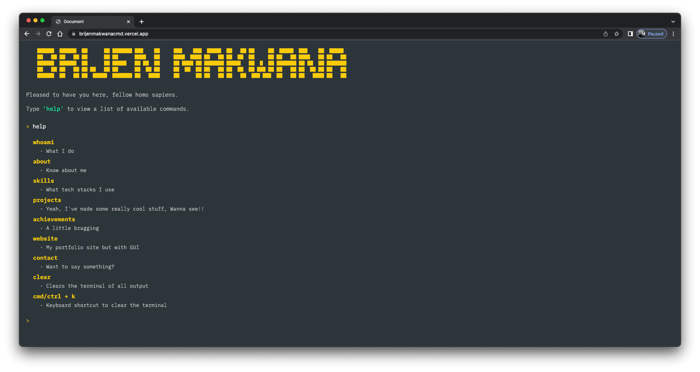
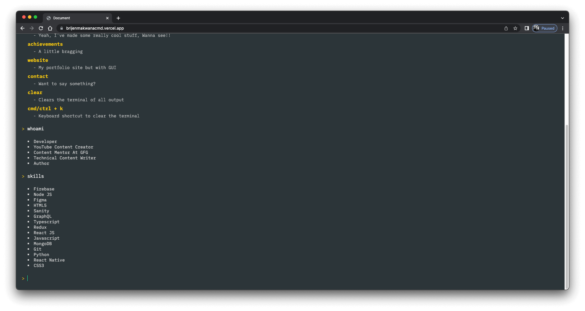
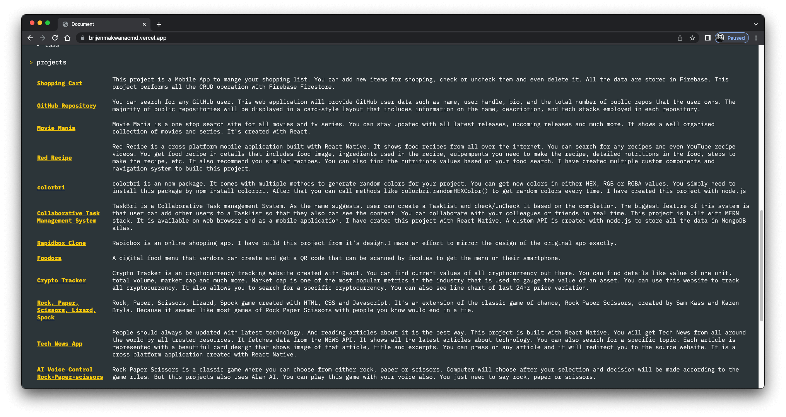
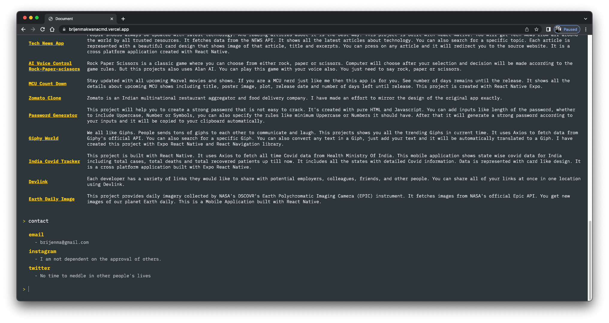

# Terminal style portfolio website

## Table of contents

- [Overview](#overview)
- [Screenshot](#screenshot)
- [Links](#links)
- [Built with](#Built-with)

## Overview

- This is not your typical GUI portfolio website. Instead, you can access my information via a command line interface.
- You can type 'help' command to view all available command you can use.
- By inputting different commands, you can learn a lot about me, including who I am, my qualifications, the projects I've worked on, my contact information, and a lot more.
- You can use 'website' command to view my GUI portfolio website.
- I have created this project with HTML, CSS and vanilla Javascript.

## Screenshot

## Links

- Live Site URL: [https://brijenmakwanacmd.vercel.app/](https://brijenmakwanacmd.vercel.app/)

## Built with

- HTML
- CSS
- Javascript
- Sanity.io API
